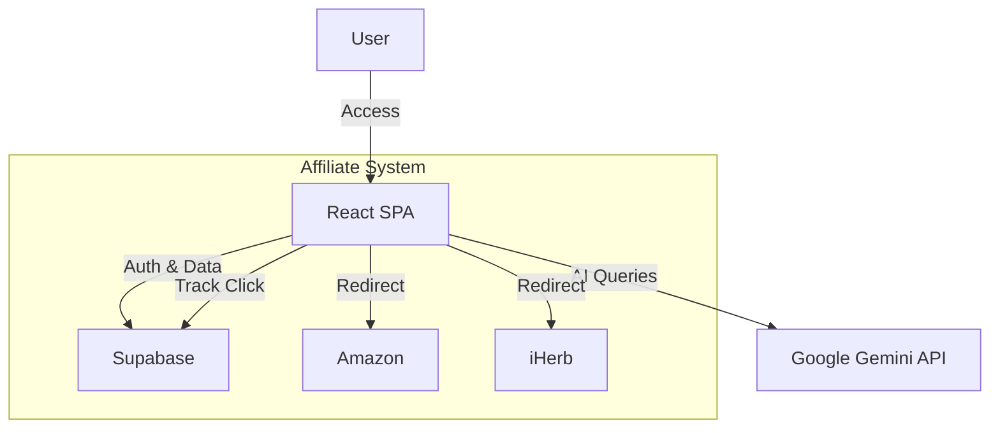

# 🦁 LionsMax - Premium Health & Wellness for 40+

> **Empowering health and vitality for the 40+ community through personalized nutrition, affiliate recommendations, and AI-powered guidance.**

[](https://github.com/iladimm/lionsmax-restart/actions)
[](https://github.com/iladimm/lionsmax-restart/actions)
[](https://opensource.org/licenses/MIT)

[](https://github.com/prettier/prettier)

---

## 📖 Overview

**LionsMax** is a modern health and wellness platform designed specifically for adults aged 40+. It combines:

- 🎯 **Curated Product Recommendations** - Supplements, vitamins, and wellness products
- 🤖 **AI-Powered Wellness Assistant** - Personalized health guidance via Google Gemini
- 💰 **Affiliate Tracking System** - Complete click and conversion tracking with Supabase
- 📊 **Analytics Dashboard** - Track performance and optimize recommendations
- 🚀 **SEO Optimized** - Built for discoverability and organic growth

---

## 🏗️ Architecture



See [Architecture Overview](docs/architecture/overview.md) for details.

---

## ✨ Key Features

### For Users
- Premium, curated health product catalog
- Interactive AI wellness assistant for personalized advice
- Product reviews and ratings
- Educational wellness content
- Mobile-responsive design

### For Business
- Affiliate commission tracking via Supabase
- Real-time analytics with `affiliate_stats` view
- UTM parameter tracking for campaign optimization
- Automated deployment via GitHub Actions
- Integration ready for n8n workflows

---

## 🚀 Quick Start

### Prerequisites

- **Node.js** >= 18.0.0
- **npm** or **yarn**
- **Supabase Account** (for affiliate tracking)
- **Google Gemini API Key** (for AI assistant)

### Installation

1. **Clone the repository**
   ```bash
   git clone https://github.com/iladimm/lionsmax-restart.git
   cd lionsmax-restart
   ```

2. **Install dependencies**
   ```bash
   npm install
   ```

3. **Set up environment variables**
   ```bash
   cp .env.example .env.local
   ```
   
   Edit `.env.local` with your credentials:
   ```env
   VITE_GEMINI_API_KEY=your_gemini_api_key
   VITE_SUPABASE_URL=your_supabase_url
   VITE_SUPABASE_ANON_KEY=your_supabase_anon_key
   VITE_AFFILIATE_ID=lionsmax-site
   VITE_AFFILIATE_COMMISSION_PERCENT=5
   VITE_IHERB_AFFILIATE_REF=your_iherb_ref
   ```

4. **Set up Supabase database**
   - Execute `database/schema.sql` in Supabase SQL Editor
   - Execute `database/rls-policies.sql` to enable Row Level Security
   - See [Database Setup Guide](docs/guides/rls-setup.md) for details

5. **Start development server**
   ```bash
   npm run dev
   ```
   
   Open [http://localhost:5173](http://localhost:5173) in your browser.

---

## ❓ FAQ

**Q: How do I add a new affiliate product?**
A: Add the product details to `src/data/products.ts`. The `AffiliateButton` will automatically handle tracking.

**Q: Why isn't the AI assistant working?**
A: Ensure your `VITE_GEMINI_API_KEY` is correctly set in `.env.local` and has quota available.

**Q: How do I deploy to production?**
A: Push to the `main` branch. GitHub Actions will automatically build and deploy to Hostinger via FTP.

---

## 🏗️ Project Structure

```
lionsmax-restart/
├── src/                    # Source code
│   ├── components/        # React components
│   │   ├── home/         # Homepage components
│   │   ├── ui/           # Reusable UI components
│   │   └── layout/       # Layout components
│   ├── hooks/            # Custom React hooks
│   ├── lib/              # Third-party integrations
│   ├── pages/            # Page components
│   ├── data/             # Static data
│   └── types/            # TypeScript definitions
├── database/              # Database schemas & migrations
├── docs/                  # Documentation
│   ├── guides/           # User & developer guides
│   ├── project/          # Project documentation
│   └── architecture/     # Technical architecture docs
├── public/               # Static assets
└── .github/workflows/    # CI/CD pipelines
```

---

## 📚 Documentation

Comprehensive documentation is available in the `/docs` directory:

### For Developers
- **[Getting Started](docs/guides/getting-started.md)** - First steps
- **[Development Guide](docs/guides/development.md)** - Local setup and development workflow
- **[Testing Guide](docs/guides/testing.md)** - How to test the affiliate system
- **[Deployment Guide](docs/guides/deployment.md)** - Deploy to production

### Technical Documentation
- **[Architecture Overview](docs/architecture/overview.md)** - System design
- **[Affiliate System](docs/architecture/affiliate-system.md)** - How tracking and commissions work
- **[Database Schema](database/README.md)** - Database structure and setup
- **[API Documentation](docs/api/)** - API endpoints and usage

### Project Information
- **[Project Status](docs/project/status.md)** - Current state and roadmap
- **[Phase 1 Plan](docs/project/phase-1.md)** - Development phases

---

## 🤝 Contributing

We welcome contributions! Please see our [Contributing Guide](CONTRIBUTING.md) for details.

### Development Workflow

1. Fork the repository
2. Create a feature branch (`git checkout -b feature/amazing-feature`)
3. Commit your changes (`git commit -m 'Add amazing feature'`)
4. Push to the branch (`git push origin feature/amazing-feature`)
5. Open a Pull Request

### Code Style

- Follow TypeScript best practices
- Use Prettier for code formatting
- Write meaningful commit messages
- Add tests for new features

---

## 🛠️ Tech Stack

- **Frontend**: React 18, TypeScript, Tailwind CSS
- **Build Tool**: Vite
- **Backend Services**: Supabase (Database & Auth)
- **AI**: Google Gemini API
- **Analytics**: React GA4
- **Deployment**: GitHub Actions → Hostinger via FTP
- **Automation**: n8n (optional)

---

## 📊 Affiliate System

LionsMax includes a comprehensive affiliate tracking system:

- **Click Tracking**: Every product click is logged to Supabase
- **UTM Parameters**: Automatic campaign tracking
- **Commission Calculation**: Track estimated earnings
- **Analytics Dashboard**: View performance metrics
- **Multi-Platform Support**: iHerb, Amazon, custom links

See the [Affiliate System Guide](docs/architecture/affiliate-system.md) for details.

---

## 🧪 Testing

```bash
# Run tests
npm test

# Run tests with coverage
npm run test:coverage

# Type checking
npm run type-check

# Linting
npm run lint
```

---

## 🚀 Deployment

The project auto-deploys to production via GitHub Actions on push to `main`.

Manual deployment:
```bash
npm run build
# Upload dist/ to your hosting provider
```

See the [Deployment Guide](docs/guides/deployment.md) for detailed instructions.

---

## 📄 License

This project is licensed under the MIT License - see the [LICENSE](LICENSE) file for details.

---

## 🙏 Acknowledgments

- [iHerb](https://www.iherb.com/) - Health product partner
- [Supabase](https://supabase.com/) - Database and authentication
- [Google Gemini](https://deepmind.google/technologies/gemini/) - AI assistant
- [Tailwind CSS](https://tailwindcss.com/) - Styling framework

---

## 📞 Support

- **Documentation**: [/docs](docs/)
- **Issues**: [GitHub Issues](https://github.com/iladimm/lionsmax-restart/issues)
- **Discussions**: [GitHub Discussions](https://github.com/iladimm/lionsmax-restart/discussions)

---

<div align="center">
  <strong>Made with ❤️ for the 40+ wellness community</strong>
</div>
