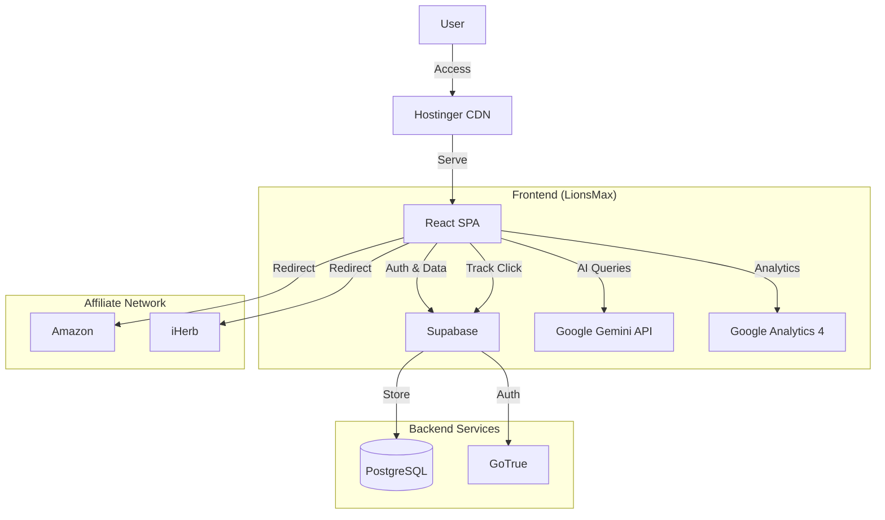

# Architecture Overview

## System Architecture

LionsMax is a modern single-page application (SPA) built with React and Vite, utilizing serverless services for backend functionality.

## Key Components

### 1. Frontend Application
- **Framework**: React 18 with TypeScript
- **Build Tool**: Vite
- **Styling**: Tailwind CSS
- **State Management**: React Context + Hooks

### 2. Affiliate Tracking System
The core business logic revolves around the affiliate tracking system:
- **Click Tracking**: Captures user clicks on product links.
- **UTM Handling**: Preserves and forwards marketing parameters.
- **Platform Detection**: Automatically routes to the correct affiliate program (Amazon/iHerb).

### 3. Data Layer (Supabase)
- **Users**: User profiles and authentication.
- **Affiliate Clicks**: Logs of all outbound affiliate clicks.
- **Conversions**: Tracked sales and commissions.

### 4. AI Integration
- **Google Gemini**: Provides personalized health and wellness recommendations based on user input.

## Deployment Pipeline

1. **Code Push**: Developer pushes to GitHub `main` branch.
2. **CI/CD**: GitHub Actions triggers:
   - Linting & Type Checking
   - Unit Tests
   - Security Scan
   - Build
3. **Deployment**: Built assets are uploaded to Hostinger via FTP.

## Security

- **Row Level Security (RLS)**: Restricts database access.
- **Environment Variables**: Sensitive keys managed via `.env`.
- **Content Security Policy**: configured in headers.
